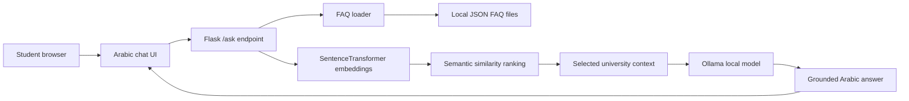

# ChatUB Architecture

ChatUB is a local Arabic academic assistant prototype. The architecture is designed around trusted university FAQ content, semantic matching, and local generation through Ollama.

## System Flow

## Key Design Decisions

- Keep university knowledge local so the prototype can be reviewed without external data services.
- Use semantic similarity before generation so answers have a domain-specific anchor.
- Treat Ollama generation as the answer layer, not as the only source of truth.
- Keep the UI simple so evaluation can focus on answer quality and retrieval behavior.

## Production Gaps

- Source citations should be attached to every answer.
- Embeddings should be generated offline instead of during startup.
- Model artifacts and checkpoints should be reviewed before keeping them in Git.
- The project needs an answer-quality evaluation set and hallucination checks.
